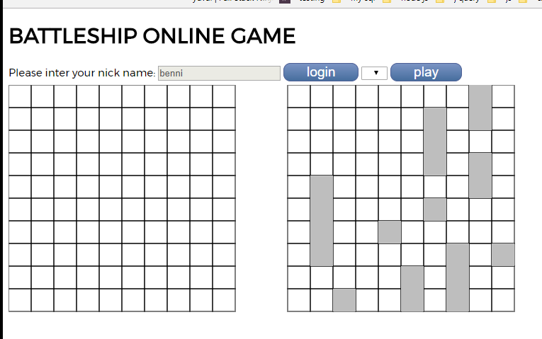
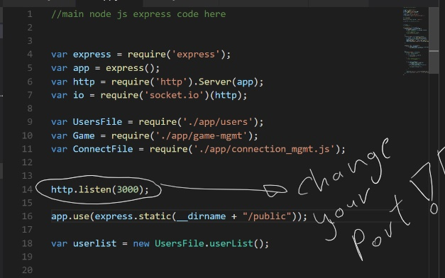

# Battle ship online game

## intro

Battleship is a guessing game for two players. It is played on ruled grids  on which the players' fleets of ships  are marked. The locations of the fleet are concealed from the other player. Players alternate turns calling "shots" at the other player's ships, and the objective of the game is to destroy the opposing player's fleet.

 

## instaletion
donwload all the files to your comp ,and ---> 

    npm init

    app.js

## settings

change port to 80 in file app.js--->

## finely

# njoy

